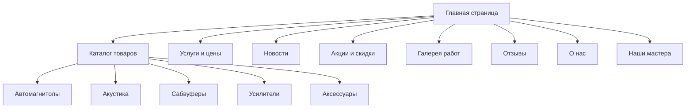
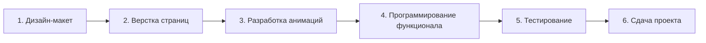

# Техническое задание на разработку сайта ТАТаудио

## 1. Общие сведения о проекте

### 1.1 Название проекта
Мультистраничный сайт для студии автозвука **ТАТаудио**

### 1.2 Цель проекта
Создание современного, привлекательного сайта-визитки с каталогом товаров для привлечения клиентов и демонстрации услуг студии автозвука.

### 1.3 Целевая аудитория
- Владельцы автомобилей, заинтересованные в качественном автозвуке
- Возраст: 18-45 лет
- География: Россия, с фокусом на региональный рынок

---

## 2. Структура сайта

### 2.1 Карта сайта



### 2.2 Страницы сайта

| Страница | URL | Описание |
|----------|-----|----------|
| Главная | /index.html | Лендинг с основной информацией о компании |
| Каталог товаров | /catalog.html | Каталог с категориями и карточками товаров |
| Услуги и цены | /services.html | Перечень услуг с описанием и ценами |
| Новости | /news.html | Лента новостей компании |
| Акции и скидки | /promotions.html | Текущие акции, специальные предложения и скидки |
| Галерея работ | /gallery.html | Фотогалерея выполненных проектов |
| Отзывы | /reviews.html | Отзывы клиентов о компании |
| О нас | /about.html | Информация о компании, история, преимущества |
| Наши мастера | /team.html | Команда специалистов с описанием опыта |

---

## 3. Функциональные требования

### 3.1 Главная страница

**Секции:**
1. **Hero-секция** - полноэкранный баннер с анимацией и призывом к действию
2. **О компании** - краткое описание деятельности
3. **Популярные категории** - карточки категорий товаров
4. **Преимущества** - иконки с описанием преимуществ компании
5. **Последние новости** - превью 3 последних новостей
6. **Контакты** - телефон, адрес, форма быстрой заявки

**Функционал:**
- Адаптивный слайдер в hero-секции
- Анимированное появление элементов при скролле
- Кнопки быстрого перехода в каталог

### 3.2 Каталог товаров

**Категории товаров:**
- Автомагнитолы
- Акустика
- Сабвуферы
- Усилители
- Аксессуары

**Карточка товара включает:**
- Изображение товара
- Название
- Краткое описание
- Характеристики
- Кнопка "Подробнее"

**Функционал:**
- Фильтрация по категориям
- Поиск по названию
- Модальное окно с детальной информацией о товаре
- Анимация при наведении на карточки

### 3.3 Страница "Услуги и цены"

**Категории услуг:**
- Установка аудиосистем
- Шумоизоляция автомобиля
- Установка сигнализаций
- Настройка аудиосистем
- Изготовление корпусов сабвуферов на заказ
- Диагностика и ремонт

**Карточка услуги:**
- Иконка/изображение
- Название услуги
- Описание
- Цена (от ... руб.)
- Срок выполнения
- Кнопка "Заказать"

**Функционал:**
- Фильтрация по категориям
- Раскрывающиеся блоки с детальным описанием
- Форма быстрой заявки на услугу
- Возможность прикрепить фото автомобиля для оценки

### 3.4 Страница "Новости"

**Функционал:**
- Сетка новостей с превью
- Пагинация или кнопка "Показать ещё"
- Фильтрация по дате/категории
- Модальное окно или отдельная страница для полной новости

**Карточка новости:**
- Изображение
- Заголовок
- Дата публикации
- Краткий текст
- Кнопка "Читать далее"

### 3.5 Страница "Акции и скидки"

**Секции:**
1. **Текущие акции** - карточки активных специальных предложений
2. **Горячие предложения** - товары со скидками с таймером обратного отсчёта
3. **Архив акций** - завершённые акции

**Карточка акции:**
- Изображение/баннер акции
- Название акции
- Размер скидки (в процентах или рублях)
- Срок действия (даты или таймер)
- Краткое описание
- Кнопка "Подробнее"

**Функционал:**
- Таймер обратного отсчёта для акций с ограниченным сроком
- Фильтрация по типу (скидки, подарки, услуги)
- Анимированные баннеры с мигающими элементами "Горячее предложение"
- Возможность подписки на уведомления о новых акциях

**Визуальные эффекты:**
- Пульсирующие бейджи "СКИДКА", "АКЦИЯ"
- Анимированные проценты скидки
- Красные акцентные элементы для привлечения внимания

### 3.6 Страница "Галерея работ"

**Секции:**
1. **Фильтр по категориям** - тип работ, марка автомобиля
2. **Сетка фотографий** - masonry-раскладка
3. **Модальное окно** - увеличенный просмотр с описанием

**Карточка работы:**
- Фотография "до/после" (опционально)
- Название проекта
- Описание выполненных работ
- Марка и модель автомобиля
- Использованное оборудование
- Стоимость работ (опционально)

**Функционал:**
- Фильтрация по категориям (автозвук, шумоизоляция, сигнализации)
- Фильтрация по марке автомобиля
- Lightbox для просмотра фотографий
- Ленивая загрузка изображений
- Кнопка "Показать ещё"

**Визуальные эффекты:**
- Анимация при наведении (масштабирование, затемнение)
- Плавное появление изображений
- Эффект "до/после" с ползунком

### 3.7 Страница "Отзывы"

**Секции:**
1. **Общий рейтинг** - средняя оценка компании
2. **Фильтр отзывов** - по оценке, по услуге, по дате
3. **Список отзывов** - с пагинацией
4. **Форма добавления отзыва**

**Карточка отзыва:**
- Аватар клиента (или заглушка)
- Имя клиента
- Оценка (звёзды 1-5)
- Дата отзыва
- Текст отзыва
- Фотографии (опционально)
- Ответ компании (опционально)

**Функционал:**
- Сортировка по дате, оценке
- Фильтрация по типу услуги
- Форма добавления отзыва с возможностью загрузки фото
- Модерация отзывов (для администратора)
- Возможность оставить отзыв через соцсети

**Визуальные эффекты:**
- Анимированные звёзды рейтинга
- Плавное появление отзывов
- Hover-эффекты на карточках

### 3.8 Страница "О нас"

**Секции:**
1. История компании
2. Миссия и ценности
3. Достижения и награды
4. Галерея работ
5. Сертификаты и партнёры

### 3.9 Страница "Наши мастера"

**Карточка мастера:**
- Фотография
- ФИО
- Должность/специализация
- Стаж работы
- Описание опыта и навыков
- Сертификаты/награды

**Функционал:**
- Анимированное появление карточек
- Hover-эффекты на карточках

### 3.10 Общие элементы

**Шапка сайта:**
- Логотип ТАТаудио
- Навигационное меню
- Номер телефона
- Кнопка "Заказать звонок"

**Подвал сайта:**
- Логотип
- Контактная информация:
  - Телефон
  - Email
  - Адрес
- Социальные сети:
  - VK
  - Instagram
  - YouTube
- Мессенджеры:
  - WhatsApp
  - Telegram
- Форма обратной связи
- Копирайт

---

## 4. Дизайн и анимации

### 4.1 Цветовая схема

| Элемент | Цвет | HEX-код |
|---------|------|---------|
| Основной фон | Чёрный | #0D0D0D |
| Вторичный фон | Тёмно-серый | #1A1A1A |
| Акцентный цвет | Красный | #E31E24 |
| Вторичный акцент | Ярко-красный | #FF3333 |
| Текст основной | Белый | #FFFFFF |
| Текст вторичный | Серый | #B3B3B3 |

### 4.2 Типографика

- Заголовки: Montserrat Bold / Oswald Bold
- Основной текст: Open Sans / Roboto
- Акцентный текст: Montserrat SemiBold

### 4.3 Анимации

**Глобальные анимации:**
- Плавное появление элементов при скролле (fade-in, slide-up)
- Hover-эффекты на кнопках (масштабирование, свечение)
- Параллакс-эффект на фоновых изображениях

**Hero-секция:**
- Анимированный градиентный фон
- Пульсирующие элементы
- Анимация текста (печатная машинка или появление)

**Карточки товаров и мастеров:**
- 3D-эффект при наведении (tilt)
- Красная подсветка при hover
- Плавное увеличение изображения

**Навигация:**
- Подчёркивание пунктов меню при наведении
- Анимация мобильного меню (выезд слева)
- Изменение цвета шапки при скролле

**Кнопки:**
- Ripple-эффект при клике
- Свечение красным цветом при наведении
- Плавная смена цвета

**Переходы между страницами:**
- Плавное затемнение/осветление

### 4.4 Декоративные элементы

- Геометрические фигуры с красной обводкой
- Градиентные линии
- Абстрактные паттерны в стиле аудио-волн
- Частицы или точки, движущиеся по экрану

---

## 5. Технические требования

### 5.1 Технологический стек

| Категория | Технология |
|-----------|------------|
| Разметка | HTML5 |
| Стили | CSS3 |
| Скрипты | JavaScript (ES6+) |
| Сборка | Без сборщиков, нативный код |

### 5.2 Структура файлов

```
tataudio/
├── index.html
├── catalog.html
├── services.html
├── news.html
├── promotions.html
├── gallery.html
├── reviews.html
├── about.html
├── team.html
├── css/
│   ├── style.css
│   ├── animations.css
│   └── responsive.css
├── js/
│   ├── main.js
│   ├── animations.js
│   └── components.js
├── images/
│   ├── logo/
│   ├── products/
│   ├── services/
│   ├── team/
│   ├── news/
│   ├── promotions/
│   ├── gallery/
│   ├── reviews/
│   └── icons/
└── fonts/
```

### 5.3 Адаптивность

Сайт должен корректно отображаться на устройствах:
- Десктоп: 1920px, 1440px, 1280px
- Планшет: 1024px, 768px
- Мобильные: 480px, 320px

### 5.4 Производительность

- Оптимизация изображений (WebP, сжатие)
- Ленивая загрузка изображений (lazy loading)
- Минимизация CSS и JS
- Критический CSS inline

### 5.5 SEO-требования

- Семантическая разметка HTML5
- Meta-теги для каждой страницы
- Open Graph разметка
- Структурированные данные (Schema.org)
- Sitemap.xml
- Robots.txt

### 5.6 Кроссбраузерность

Поддержка браузеров:
- Google Chrome (последние 2 версии)
- Mozilla Firefox (последние 2 версии)
- Safari (последние 2 версии)
- Microsoft Edge (последние 2 версии)

---

## 6. Форма обратной связи

### 6.1 Поля формы

1. Имя (обязательное)
2. Телефон (обязательное, маска ввода)
3. Email (опциональное)
4. Сообщение (опциональное)
5. Чекбокс согласия на обработку персональных данных

### 6.2 Функционал

- Валидация полей на клиенте
- Сообщения об ошибках
- Уведомление об успешной отправке
- Защита от спама (honeypot или reCAPTCHA)

---

## 7. Контактная информация

### 7.1 Данные для размещения на сайте

| Тип | Значение |
|-----|----------|
| Телефон | [Указать заказчиком] |
| Email | [Указать заказчиком] |
| Адрес | [Указать заказчиком] |
| VK | [Указать заказчиком] |
| Instagram | [Указать заказчиком] |
| YouTube | [Указать заказчиком] |
| WhatsApp | [Указать заказчиком] |
| Telegram | [Указать заказчиком] |

---

## 8. Этапы разработки



### 8.1 Перечень работ

1. **Дизайн-макет**
   - Разработка дизайн-макета всех страниц
   - Согласование с заказчиком

2. **Вёрстка страниц**
   - HTML-разметка всех страниц
   - CSS-стилизация
   - Адаптивная вёрстка

3. **Разработка анимаций**
   - CSS-анимации
   - JavaScript-анимации при скролле
   - Hover-эффекты

4. **Программирование функционала**
   - Фильтрация каталога
   - Модальные окна
   - Форма обратной связи
   - Мобильное меню

5. **Тестирование**
   - Кроссбраузерное тестирование
   - Тестирование на мобильных устройствах
   - Проверка производительности

6. **Сдача проекта**
   - Финальные правки
   - Передача файлов

---

## 9. Требования к контенту

### 9.1 Материалы от заказчика

- Логотип компании в векторном формате
- Фотографии товаров для каталога
- Фотографии мастеров
- Текстовое описание компании
- Контактные данные
- Тексты новостей
- Сертификаты и награды

### 9.2 Требования к изображениям

- Формат: WebP, JPEG, PNG
- Минимальное разрешение: 800x600px
- Соотношение сторон для карточек: 4:3 или 1:1
- Прозрачный фон для логотипов

---

## 10. Приёмка проекта

### 10.1 Критерии приёмки

- Соответствие дизайн-макету
- Работоспособность всех функций
- Корректное отображение на всех устройствах
- Отсутствие ошибок JavaScript в консоли
- Скорость загрузки страниц не более 3 секунд

### 10.2 Документация

- Инструкция по редактированию контента
- Описание структуры файлов
- Контакты разработчика

---

## Приложение А. Примеры анимаций

### A.1 Анимация появления карточки

```css
.card {
    opacity: 0;
    transform: translateY(30px);
    transition: all 0.6s ease;
}

.card.visible {
    opacity: 1;
    transform: translateY(0);
}
```

### A.2 Hover-эффект кнопки

```css
.btn {
    background: linear-gradient(135deg, #E31E24, #FF3333);
    transition: all 0.3s ease;
    box-shadow: 0 0 0 rgba(227, 30, 36, 0);
}

.btn:hover {
    transform: scale(1.05);
    box-shadow: 0 0 20px rgba(227, 30, 36, 0.5);
}
```

### A.3 Анимация градиента в hero

```css
.hero {
    background: linear-gradient(135deg, #0D0D0D, #1A1A1A, #0D0D0D);
    background-size: 400% 400%;
    animation: gradientShift 15s ease infinite;
}

@keyframes gradientShift {
    0% { background-position: 0% 50%; }
    50% { background-position: 100% 50%; }
    100% { background-position: 0% 50%; }
}
```

---

**Дата создания ТЗ:** 13.02.2026  
**Версия документа:** 1.0  
**Статус:** На согласовании
